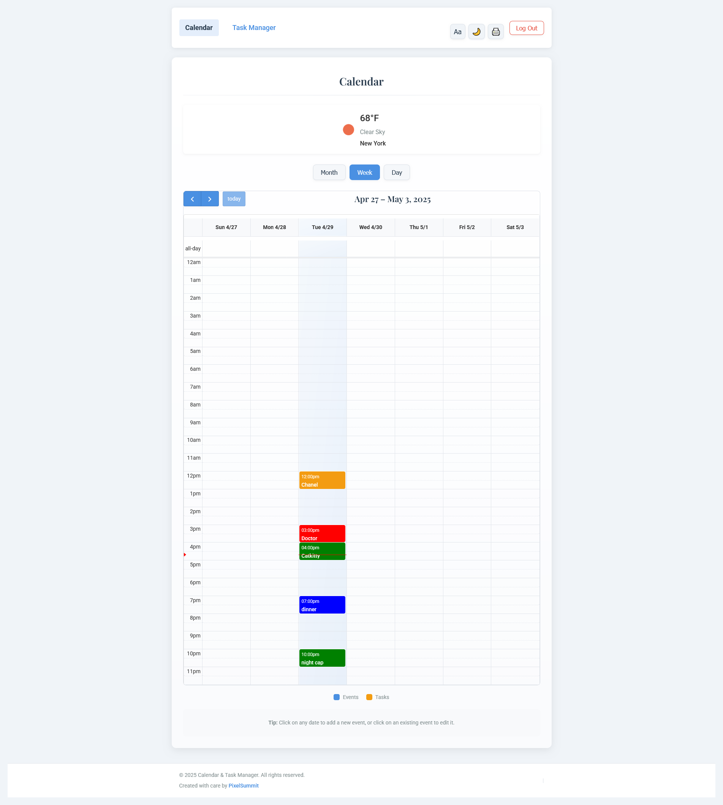
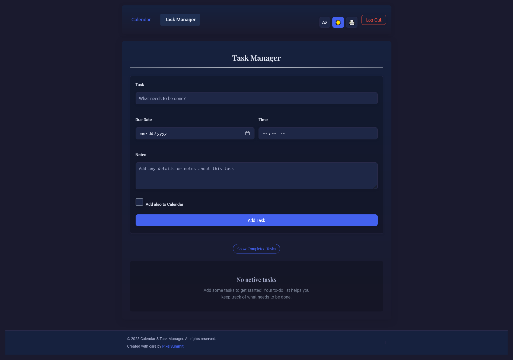

# Calendar & Task Manager App

A clean calendar and task management application designed with accessibility in mind (and without fuss). Perfect for keeping track of appointments, events, and to-do lists. I built this mini web-app for my aunt who needs a simple way to manage her schedule and tasks. Based loosely on the [Pomodoro Technique](https://en.wikipedia.org/wiki/Pomodoro_Technique).

> Accessible and clean Calendar


> Task manager with dark mode



## Features

### Calendar Features
- View calendar by month, week, or day
- Create one-time or recurring events
- Color code different types of events
- Easy event creation by clicking on dates
- Edit or delete existing events
- View todos with due dates on the calendar
- Current weather display
- Print calendar view
- Add calendar events directly to task list

### Task Manager Features
- Create tasks with title, description, due date, and time
- Optionally add tasks to calendar
- Organize tasks by urgency/timeline
- Mark tasks as complete
- Edit and delete tasks
- Filter to view/hide completed tasks
- Tabbed interface to easily navigate between time categories
- Task count indicators to see at a glance where attention is needed
- Color-coded tabs that match urgency levels

### Accessibility Features
- Large text mode for better readability
- Dark mode to reduce eye strain
- Print functionality
- Mobile responsive design
- Clean, uncluttered interface
- High contrast visual elements
- Improved task organization reduces cognitive load
- Reduced scrolling with tabbed interface

## Getting Started

### Prerequisites
- Node.js (v14 or higher)
- npm or yarn

### Installation

1. Clone the repository
```bash
git clone https://github.com/leverh/calendar-app
cd calendar-app
```

2. Install dependencies
```bash
npm install
# or
yarn install
```

3. Set up environment variables
Create a `.env` file in the root directory with the following variables:
```
VITE_FIREBASE_API_KEY=your_firebase_api_key
VITE_FIREBASE_AUTH_DOMAIN=your_firebase_auth_domain
VITE_FIREBASE_PROJECT_ID=your_firebase_project_id
VITE_FIREBASE_STORAGE_BUCKET=your_firebase_storage_bucket
VITE_FIREBASE_MESSAGING_SENDER_ID=your_firebase_messaging_sender_id
VITE_FIREBASE_APP_ID=your_firebase_app_id
VITE_OPENWEATHER_API_KEY=your_openweather_api_key
```

4. Start the development server
```bash
npm run dev
# or
yarn dev
```

## Usage

### Account Setup
- Log in with your email and password
- All your events and tasks will be saved to your account

### Creating Events
1. Click on any date in the calendar
2. Fill out the event details (title, time, color, etc.)
3. Choose if the event repeats (daily, weekly, monthly)
4. Optionally add the event to your task list for tracking
5. Save the event

### Managing Tasks
1. Navigate to the Task Manager tab
2. Add new tasks using the form at the top
3. Set due dates and optional calendar display
4. Switch between time-based tabs to focus on specific priorities
5. Mark tasks complete when finished
6. Use the "Show Completed Tasks" toggle to view completed items

### Accessibility Options
- Click the "Aa" button to toggle large text mode
- Click the moon/sun icon to toggle dark mode
- Click the printer icon to print the current view

## Technical Details

### Tech Stack
- React for UI components
- Firebase for authentication and data storage
- FullCalendar for calendar functionality
- Modular CSS for styling
- OpenWeatherMap API for weather data

### Project Structure
```
src/
  ├── components/         # React components
  ├── firebase/           # Firebase configuration
  ├── styles/             # CSS files
  │   ├── base.css        # Base styles and variables
  │   ├── components/     # Component-specific styles
  │   ├── pages/          # Page-specific styles
  │   ├── utils/          # Utility styles
  │   └── index.css       # Main CSS entry point
  ├── App.js              # Main application component
  └── main.jsx            # Application entry point
```

## Customization

### Setting Default Location for Weather
Update the `location` prop in the WeatherWidget component in CalendarView.jsx:
```jsx
<WeatherWidget location="Your City, Country" />
```

### Changing Color Schemes
Edit the CSS variables in the `base.css` file to customize the color scheme.

### Task Categories
The app automatically organizes tasks into the following time-based categories:
1. Immediate Attention (Today) - Tasks due today
2. Attention Soon (Tomorrow) - Tasks due tomorrow
3. Attention This Week - Tasks due within 7 days
4. Attention This Month - Tasks due this month
5. Next Quarter - Tasks due within the next 3 months
6. This Lifetime - Tasks without a due date or due beyond 3 months

## License
This project is licensed under the MIT License.

## Acknowledgments
- FullCalendar for the calendar functionality
- OpenWeatherMap for weather data
- Firebase for authentication and database services
